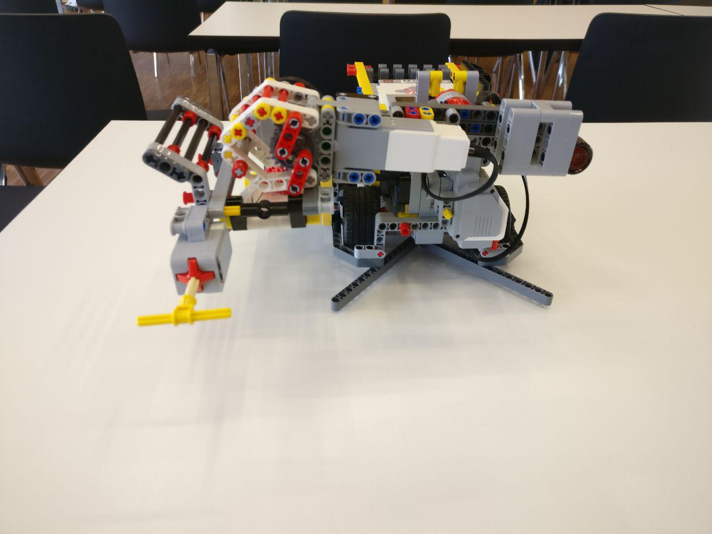
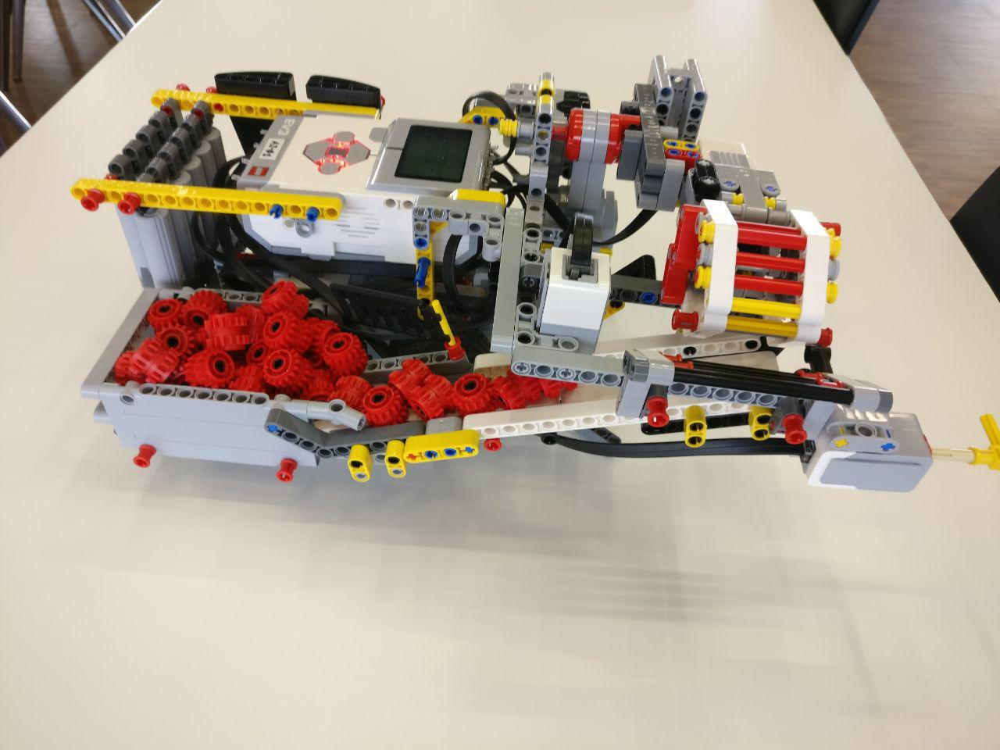
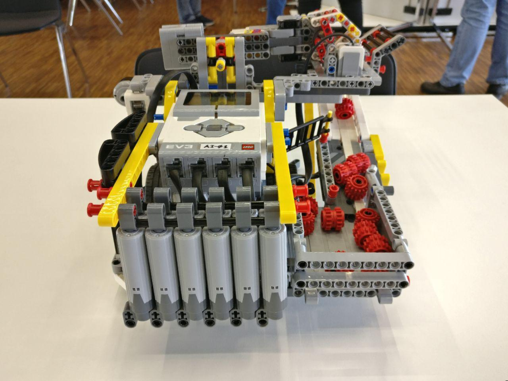
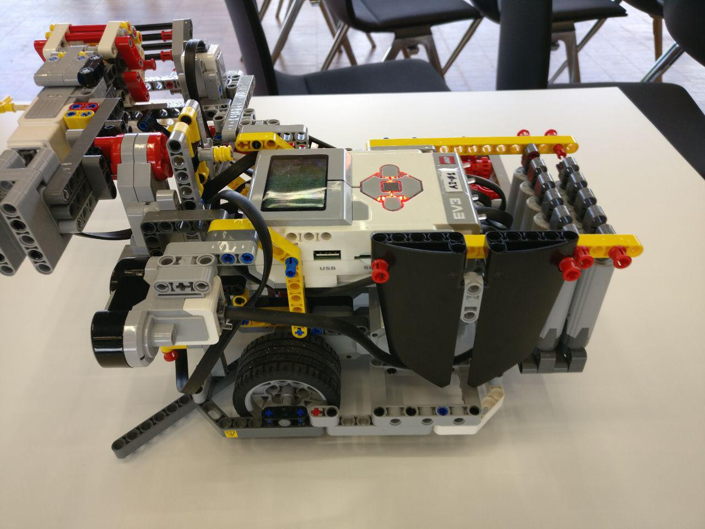

# Objekte koordiniert sammeln
## Problemstellung
### Offizielle Aufgabenstellung
Auf einer Fläche sind kleine Kugeln beliebig verteilt. Jeder MINDSTORM verfügt über einen Behälter für die Aufnahme einer bestimmten Anzahl von Kugeln. Die MINDSTORMS sammeln die Kugeln ein und legen diese im Behälter ab. Ist die Kapazität des Behälters ausgeschöpft, fährt der MINDSTORM zu einer Sammelstation und entleert diesen Behälter. Nach Entleerung des Behälters setzt der MINDSTORM das Sammeln fort. Findet ein MINDSTORM in einem Zeitintervall von 30 Sekunden keine Kugeln, hält der MINDSTORM an (https://www.youtube.com/watch?v=InwBP9AnOaM).

### Modifikationen der Aufgabenstellung
- Da der Roboter sich nicht im Raum orientieren kann, kann eine Sammelstation nicht lokalisiert werden
-> Roboter soll anhalten, wenn Behälter voll

## Lösungsansatz
- Ein Greifarm an einer Rotationsachse, um Objekte aufzunehmen und in einen Behälter zu legen
- Schwarmverhalten basiert auf Abstandssensorik. Sobald ein anderer Roboter oder eine Wand zu nahe kommt, Ausweichmanöver einleiten
- Roboter hält an, wenn bestimmte Zahl an Objekte aufgenommen wurden

## Zusätzliche Infos
### Micropython Modi
- Boring Mode: Das Programm hält an, wenn der Behälter voll ist.
- Fun Mode: Sobald der Behälter voll ist schlägt der Roboter alle weiteren Objekte wie ein Golfspieler weg.

### Roboter
|   |  |
| ----------------------------- | ----------------------------- |
|  |   |